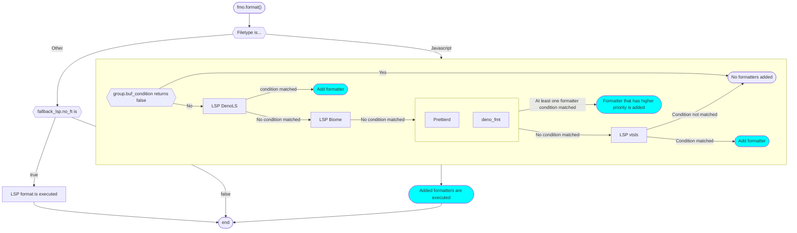

# format-order.nvim

_Restore "order" to the format_

## About

This plugin is intended to integrate
[conform.nvim](https://github.com/stevearc/conform.nvim) and lsp formatting and
allow you to write complex format settings in a simple, declarative way.

## Install & Setup

This is config example for `lazy.nvim`. This plugin does nothing about
format-on-save. You need to configure it using autocmd.

Also, unless you specify `filetypes`, this plugin does nothing. For detail, see
Config section.

```lua
{
  {
    "nazo6/format-order.nvim",
    event = { "BufRead" },
    dependencies = {
      {
        "stevearc/conform.nvim",
        config = function()
          require("conform").setup {}
        end,
      },
    },
    config = function()
      require("fmo").setup {
        -- For detail, see Config section
        filetypes = {},
      }

      vim.api.nvim_create_autocmd({ "BufWritePre" }, {
        callback = function()
          require("fmo").format()
        end,
      })
    end,
  },
}
```

## Config

It is difficult to fully describe in words how this plugin works, so here is
example code and diagrams.

### Example 1: Web

Setup for web development. For simplicity, only JavaScript is configured.

```lua
local formatters = {
	prettierd = {
		type = "conform",
		name = "prettierd",
		root_pattern = {
			-- omitted in this example
		},
	},
	deno_fmt = { type = "conform", name = "deno_fmt", root_pattern = { "deno.json", "deno.jsonc" } },
}

require("fmo").setup({
	filetypes = {
		javascript = {
			groups = {
				{
					specs = {
						{ { type = "lsp", name = "denols" } },
						{ { type = "lsp", name = "biome" } },
						{
							formatters.prettierd,
							formatters.deno_fmt,
						},
						{ { type = "lsp", name = "vtsls" } },
					},
				},
			},
			default = formatters.deno_fmt,
		},
	},
})
```

And the diagram of the example is:



## Config detail

The general flow is as explained above, but the details are described below.

### Spec

Each formatter config table such as below is `spec`.

```lua
{
  type = "conform",
  name = "prettierd",
  root_pattern = {
    ".prettierrc",
    ".prettierrc.json",
    ".prettierrc.yml",
    ".prettierrc.yaml",
    ".prettierrc.json5",
    ".prettierrc.js",
    ".prettierrc.cjs",
    ".prettierrc.mjs",
    ".prettierrc.toml",
    "prettier.config.js",
    "prettier.config.cjs",
  },
}
```

Each spec must have `type` and `name` fields.

This plugin does not execute format by itself but relies on `conform.nvim` and
nvim-lsp. So, `type` must be either `conform` or `lsp`.

`name` is the name of the formatter. In `conform` type, this must be conform
formatter name. In `lsp` type, this is the name of the LSP server.

Other fields are described below.

### Condition

Each formatter has a condition. If the condition is met, the formatter is added
to the list of formatters to be executed. You can add condition with
`init_condition`, `buf_condition` option.

If `root_pattern` and `filetypes` options are specified, they are automatically
added to the buf_condition.

- `init_condition` is cached. It is executed only once.
- `buf_condition` is executed for each time format is executed.
- `root_pattern` is same as lspconfig's `root_dir` option. If not specified,
  always true.
- `filetypes` is a list of filetypes. If not specified, always true.

Also, in `lsp` type, unless lsp server is available, the condition is always
false.

### Priority

In the second layer of the spec group, the formatter with the highest priority
is selected.

Currently, this plugin uses `root_pattern` to determine priority. The formatter
that has deeper root has higher priority.
